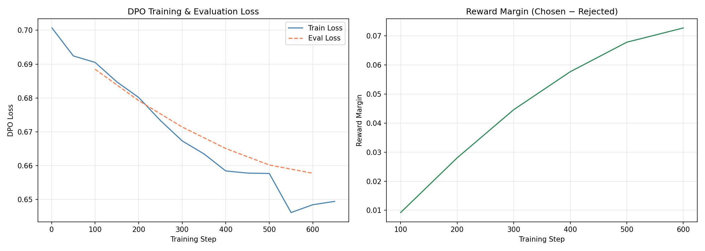

# A5: Human Preference Optimization & LLM-as-a-Judge

## Overview
Fine-tuning `Qwen/Qwen2.5-1.5B-Instruct` using Direct Preference Optimization (DPO)
on the `jondurbin/truthy-dpo-v0.1` dataset to reduce hallucinations,
evaluated using LLM-as-a-Judge on AlpacaEval.

## Requirements
- Python 3.11
- Apple Silicon Mac (MPS backend)

## Installation
pip install transformers trl peft datasets accelerate groq huggingface_hub jupyter torch

## How to Run
Open `A5_Human_Preference_DPO.ipynb` and run cells top to bottom.

## Results
| Metric | Value |
|--------|-------|
| Final Train Loss | 0.648 |
| Final Eval Loss | 0.658 |
| Reward Margin | 0.072 |
| DPO Win Rate | 50.0% |

## Model
https://huggingface.co/luckydprince/qwen2.5-1.5b-dpo-truthy

## Training Curves
